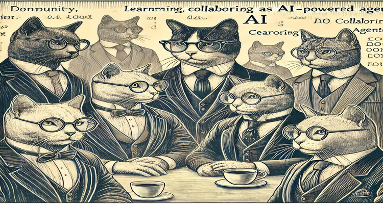

<center>



</center>

#  <center> NARNIAN - NAtuRe iNspired Intelligent AgeNts </center>

[](https://opensource.org/licenses/MIT) 

## What is it?

Narnian is a nature-inspired framework that simulates an evolving ecosystem of intelligent agents. Designed for flexibility and extensibility, it enables researchers and developers to study dynamic learning and teaching processes in a customizable simulation world. Agents capture real-time data streams, adapt their behavior using Finite State Machines (FSMs), and can even evolve from students into teachers as they gain new capabilities.

## Dictionary of Key Concepts

- **Agents**  
  Narnian is roled by Agents, an agent is an entity that can interact with the environment and with the other agents living in it. Agents can be human or artificial, and they can have different levels of intelligence and different learning capabilities. Agents can be controlled by the user, or they can be controlled by the framework itself. An agent can be a student, a teacher, or any other entity that can interact with the environment. Each agent is represented by its Finite State Machine (FSM) which role its behavior.

- **Streams**  
  Real-time data flows representing sensory informations or descriptors from the environment.

- **Environment**  
  The simulation world where agents and streams coexist. The enviroment can be a physical world, a virtual world, or a combination of both. The environment can be static or dynamic, and it can have different levels of complexity. The environment can be controlled by the user, or it can be controlled by the framework itself. 

---

## Installation

Install a python enviroment ensuring than you have python 3.8 or higher.

Using [Anaconda](https://www.anaconda.com/products/individual) or [Miniconda](https://docs.conda.io/en/latest/miniconda.html): 

```bash
conda create -n narnian python=3.8
conda activate narnian
```

Clone the repository:

```bash
git clone https://github.com/mela64/narnian
cd narnian
```

Install the dependecies with pip:

```bash
pip install -r requirements.txt
```

Try one of the examples:

```bash
python sandbox_example.py # A simple example of a Narnian simulation.
```

---

### Project Structure

Narnian is structured as follows:

<!DOCTYPE html>
<html lang="en">
<head>
  <meta charset="UTF-8">
  <title>narnian Folder Tree</title>
  <style>
    .agent       { color: red; }
    .attributes  { color: blue; }
    .environment { color: green; }
    .model       { color: purple; }
    .streams     { color: orange; }
    pre { font-family: monospace; }
  </style>
</head>
<body>
<pre>
narnian/
├── narnian/
│   ├── __init__.py         # Package initializer
│   ├── <span class="agent">agents.py</span>           # Manages an agent's behavior, communication, and interactions
│   ├── <span class="attributes">attributes.py</span>       # Manages attributes and labels for streams
│   ├── <span class="environment">environment.py</span>      # Defines the environment where agents and streams interact
│   ├── fsm.py              # Implements Finite State Machines for agent behaviors
│   ├── <span class="model">model.py</span>            # Contains the core simulation models
│   ├── server.py           # Manages a server which makes the narnian world accessible through a web app
│   ├── <span class="streams">streams.py</span>          # Handles real-time data streams      
</pre>
</body>
</html>

#### Basic Instance
A basic instance of the Narnian framework is available in the **./basic** folder. It contains an example of a simulated environment where agents named students and a teacher coexist. The teacher records information from the environment and then teaches the students using that information. After a learning run, the students are evaluated on their capabilities, and the teacher decides if a student is ready to become a teacher or if it needs more assistance with several runs.

<!DOCTYPE html>
<html lang="en">
<head>
  <meta charset="UTF-8">
  <title>narnian Basic Folder Tree</title>
  <style>
    .agent       { color: red; }
    .attributes  { color: blue; }
    .environment { color: green; }
    .model       { color: purple; }
    .streams     { color: orange; }
    pre { font-family: monospace; }
  </style>
</head>
<body>
<pre>
narnian/
├── basic/
│   ├── utils/
│   │   ├── hl_utils.py
│   ├── <span class="agent">basic_agent.py</span>           # Manages an agent's behavior, communication, and interactions
│   ├── <span class="attributes">attributes.py</span>       # Manages attributes and labels for streams
│   ├── <span class="environment">basic_environment.py</span>      # Defines the environment where agents and streams interact
│   ├── <span class="model">basic_model_*.py</span>            # Contains the core simulation models
│   ├── <span class="streams">basic_streams.py</span>          # Handles real-time data streams      
</pre>
</body>
</html>

### Examples

The root folder of the repository includes example simulations that showcase how to run the basic instance:

#### Animal School
Animal School is a simulation scenario built using the basic framework that mimics an educational ecosystem. In this scenario, a virtual "school" is created where a teacher agent instructs and evaluates student agents using real-time data streams composed of animal images.

At its core, the scenario emulates a classroom setting where:

- **A Teacher Agent ("Dr. Green")** collects general information from the environment, prepares an exam using the aggregate data stream, and then embarks on a teaching process. The teacher sets preferred image streams for focused instruction and evaluates student performance.

- **Student Agents ("Mario" and "Luigi")** adopt the teacher’s behavior patterns, engage with the provided data, and respond to teaching instructions. Their interactions simulate a typical learning process where they are guided, assessed, and eventually promoted based on their performance.

To execute the Animal School simulation, run the following command:

```bash
python sandbox_animal_school.py
```

It will start the server for monitoring
the simulation in a web browser. Follow the hyperlink provided in the terminal to access the web interface.

#### Cat Library
Cat Library is a simulation scenario where a digital "library" of textual data forms the basis for an educational ecosystem. In this scenario, agents interact with a stream of tokens—words or phrases related to cats. The simulation emulates a teaching and learning environment where the teacher agent compiles a "book" from the token stream, and the student agent learns from that prepared content.

To execute the Cat Library simulation, run the following command:

```bash
python sandbox_cat_library.py
```

#### Signal School
Signal School models a dynamic educational ecosystem where multiple signal streams are processed to evaluate learning, generalization, and predictive performance. The simulation involves a teacher agent orchestrating a teaching-evaluation loop over diverse signal datasets, while a student agent adapts and learns to generalize across these signals.

To execute the Signal School simulation, run the following command:

```bash
python sandbox_signal_school.py
```

---

### Basic 
Qui aggiungere un toy example guidato su come usare l'estensione basic

---

### References

- [bla bla](https://arxiv.org/abs)

